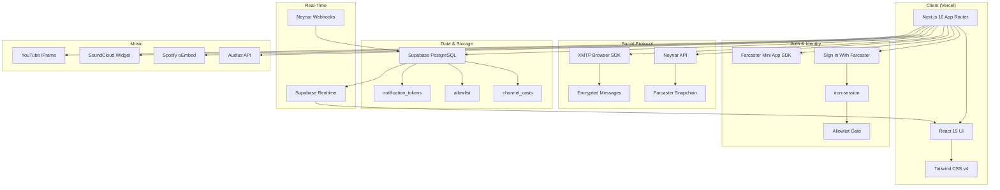

<div align="center">

<!-- Hero Banner - replace with actual screenshot when available -->
# 🎵 ZAO OS

**The decentralized music community platform built on Farcaster**

[](https://nextjs.org)
[](https://typescriptlang.org)
[](https://supabase.com)
[](https://farcaster.xyz)
[](https://xmtp.org)
[](LICENSE)

[Demo](https://zaoos.com) · [Research Library](./research/) · [Report Bug](https://github.com/bettercallzaal/ZAOOS/issues) · [Request Feature](https://github.com/bettercallzaal/ZAOOS/issues)

</div>

---

ZAO OS is a gated, music-first social platform where artists keep their revenue, curators earn reputation, and the community owns its data. Built on [Farcaster](https://farcaster.xyz) with encrypted DMs via [XMTP](https://xmtp.org), inline music playback from 6 platforms, and a Farcaster Mini App for native mobile push notifications.

> [!NOTE]
> **Why ZAO OS?** Both Sound.xyz and Catalog shut down — the NFT-only model failed. ZAO OS takes a different approach: community + messaging + subscriptions + curation rewards. Artists earn through direct fan relationships, not $0.003/stream.

<!-- Add screenshots here when available:
<div align="center">

</div>
-->

---

<details>
<summary><strong>📋 Table of Contents</strong></summary>

- [Features](#features)
- [Architecture](#architecture)
- [Quick Start](#quick-start)
- [Tech Stack](#tech-stack)
- [Project Structure](#project-structure)
- [Music Platforms](#music-platforms)
- [Research Library (39 docs)](#research-library)
- [The Vision](#the-vision)
- [Revenue Model](#revenue-model)
- [Neynar Credits](#neynar-credit-usage)
- [Reference Repos](#reference-repos)
- [Contributing](#contributing)
- [License](#license)

</details>

---

## Features

**Community**
- 🔐 Gated access — allowlist + invite codes (NFT/token gating planned)
- 💬 Discord-style chat on Farcaster channels with real-time updates
- 🔒 Encrypted DMs & group chat via XMTP (MLS protocol)
- 👥 Sortable followers/following — no other Farcaster client has this
- 📱 Farcaster Mini App with native push notifications

**Music**
- 🎵 Inline music players for Spotify, SoundCloud, Audius, YouTube, Sound.xyz, direct audio
- 📻 Music queue sidebar with continuous playback
- 🎨 Album art, waveforms, and track metadata auto-detection
- 🎤 Song submission system for community curation

**Social**
- ✍️ Compose bar with mentions, embeds, scheduling, and cross-posting
- 💬 Thread drawer for conversation replies
- 🔍 Full-text search across casts and members
- ⭐ Respect token leaderboard (on-chain, Optimism)

**Admin**
- 🛡️ Allowlist management with CSV upload
- 🚫 Message hiding for moderation
- 📊 Admin panel for community management

---

## Architecture



---

## Quick Start

### Prerequisites

| Service | What For | Free? |
|---------|----------|-------|
| [Vercel](https://vercel.com) | Hosting | Free tier |
| [Supabase](https://supabase.com) | Database + Realtime | Free tier |
| [Neynar](https://dev.neynar.com) | Farcaster API | Paid ([see credit notes](#neynar-credit-usage)) |

### 1. Clone & install

```bash
git clone https://github.com/bettercallzaal/ZAOOS.git
cd ZAOOS
npm install
```

### 2. Environment variables

```bash
cp .env.example .env.local
```

```env
# Supabase
NEXT_PUBLIC_SUPABASE_URL=https://your-project.supabase.co
SUPABASE_SERVICE_ROLE_KEY=your_service_role_key

# Neynar (Farcaster API)
NEYNAR_API_KEY=your_neynar_api_key
NEYNAR_WEBHOOK_SECRET=            # fill after Step 5

# Sign In With Farcaster
NEXT_PUBLIC_SIWF_DOMAIN=yourdomain.com

# Session encryption
SESSION_SECRET=your_session_secret_here
# Generate: node -e "console.log(require('crypto').randomBytes(32).toString('hex'))"

# App Farcaster ID + signer
APP_FID=19640
APP_SIGNER_PRIVATE_KEY=your_app_signer_private_key
# Generate: npx tsx scripts/generate-wallet.ts
```

<details>
<summary>Where to find each value</summary>

- `SUPABASE_URL` + `SERVICE_ROLE_KEY`: Supabase → Project Settings → API
- `NEYNAR_API_KEY`: dev.neynar.com → your app → API Keys
- `APP_FID`: The Farcaster account that posts casts on behalf of ZAO OS
- `APP_SIGNER_PRIVATE_KEY`: Run `npx tsx scripts/generate-wallet.ts`

</details>

### 3. Database setup

Run in Supabase SQL Editor (in order):

```
scripts/setup-database.sql          # Core tables
scripts/add-channel-casts-table.sql # Webhook cache
```

### 4. Seed the allowlist

```sql
INSERT INTO allowlist (fid, real_name, ign, is_active)
VALUES (12345, 'Artist Name', 'username', true);
```

Or CSV import: format as `real_name,wallet_address,fid` → Supabase table editor.

### 5. Register Neynar webhook

```bash
npx tsx scripts/register-neynar-webhook.ts
```

Copy the printed secret → add to `NEYNAR_WEBHOOK_SECRET` in `.env.local` and Vercel.

> [!TIP]
> Webhooks are ~57x cheaper than polling for 5 users. This is the key cost optimization.

### 6. Deploy to Vercel

```bash
# Push to GitHub, import at vercel.com/new, add env vars, deploy
```

### 7. Configure channels

Update these files to add/change watched channels:

```
src/app/api/chat/messages/route.ts   → ALLOWED_CHANNELS
src/app/api/webhooks/neynar/route.ts → WATCHED_CHANNELS
scripts/register-neynar-webhook.ts   → CHANNEL_ROOT_URLS
```

---

## Tech Stack

| Layer | Technology |
|-------|-----------|
| **Framework** | Next.js 16 (App Router) + React 19 |
| **Language** | TypeScript 5 (strict mode) |
| **Styling** | Tailwind CSS v4 |
| **Auth** | Sign In With Farcaster + iron-session |
| **Social** | Neynar API (Farcaster) + XMTP Browser SDK v7 |
| **Mini App** | @farcaster/miniapp-sdk + Quick Auth |
| **Database** | Supabase (PostgreSQL + Realtime) |
| **Validation** | Zod 4 |
| **Data Fetching** | TanStack React Query |
| **Music** | Audius API, Spotify/SoundCloud/YouTube embeds, Web Audio API |
| **Deployment** | Vercel |

---

## Project Structure

```
src/
├── app/
│   ├── (auth)/              # Protected routes (chat, messages, social, admin, respect)
│   ├── api/
│   │   ├── auth/            # SIWF verify, signer, session, register, logout
│   │   ├── chat/            # messages, send, hide, search, thread, schedule
│   │   ├── music/           # metadata, submissions
│   │   ├── messages/        # XMTP webhooks
│   │   ├── miniapp/         # Quick Auth + notification webhooks
│   │   ├── users/           # followers, following, follow, wallet
│   │   ├── respect/         # on-chain leaderboard
│   │   ├── admin/           # allowlist CRUD, CSV upload, hidden messages
│   │   ├── webhooks/neynar/ # Real-time cast ingestion (HMAC verified)
│   │   ├── search/          # User search
│   │   └── upload/          # Image upload to Supabase Storage
│   ├── layout.tsx           # Root layout + Mini App embed meta
│   └── page.tsx             # Landing (SIWF login + Mini App auto-auth)
├── components/
│   ├── chat/                # ChatRoom, Message, MessageList, ComposeBar,
│   │                        # ThreadDrawer, Sidebar, SignerConnect, SearchDialog,
│   │                        # MentionAutocomplete, SchedulePanel, TutorialPanel, FaqPanel
│   ├── messages/            # ConnectXMTP, MessagesRoom, ConversationList,
│   │                        # MessageThread, NewConversationDialog, MessageCompose
│   ├── music/               # GlobalPlayer, MusicEmbed, MusicSidebar,
│   │                        # SongSubmit, Scrubber, PlayerButtons, MusicQueueTrackCard
│   ├── social/              # SocialPage, FollowerCard, FollowerSkeleton
│   ├── admin/               # AllowlistTable, CsvUpload, HiddenMessages
│   └── gate/                # LoginButton, MiniAppGate
├── hooks/                   # useAuth, useChat, useMobile, useMiniApp,
│                            # useKeyboardShortcuts, useMusicQueue
├── lib/
│   ├── auth/                # iron-session management, admin FIDs
│   ├── database/            # Supabase client (lazy-loaded)
│   ├── farcaster/           # Neynar wrapper (23 functions)
│   ├── gates/               # Allowlist check (FID + wallet)
│   ├── xmtp/               # Browser SDK client, wallet signer
│   ├── music/               # URL detection, embed parsing, duration formatting
│   ├── validation/          # Zod schemas for all inputs
│   ├── notifications.ts     # Mini App push (batch, multi-client, token invalidation)
│   ├── rate-limit.ts        # In-memory per-IP rate limiter
│   └── env.ts               # Validated environment variables
├── contexts/                # XMTPContext (multi-wallet state)
├── providers/audio/         # PlayerProvider, Spotify, YouTube, SoundCloud, HTMLAudio
└── types/                   # Cast, TrackMetadata, XMTPMessage, SessionData

scripts/
├── setup-database.sql
├── add-channel-casts-table.sql
├── register-neynar-webhook.ts
└── generate-wallet.ts
```

---

## Music Platforms

| Platform | Detection | Metadata | Playback |
|----------|-----------|----------|----------|
| SoundCloud | URL pattern | oEmbed (no key) | Widget API |
| Audius | URL pattern | Audius API (no key) | HTML5 Audio |
| Spotify | URL pattern | oEmbed (no key) | IFrame API |
| YouTube | URL pattern | oEmbed (no key) | IFrame API |
| Sound.xyz / Zora | URL pattern | GraphQL | HTML5 Audio |
| Direct audio | .mp3 .wav .ogg | Filename | HTML5 Audio |

---

## Research Library

> **43 research documents · ~300,000+ words** covering every aspect of building a decentralized social media platform for music.

See the full **[Research Hub](./research/)** for the complete index with summaries and Mermaid architecture diagrams.

<details>
<summary><strong>Farcaster Protocol & Ecosystem (8 docs)</strong></summary>

| # | Topic | Summary |
|---|-------|---------|
| 01 | Farcaster Protocol | On-chain identity (Optimism) + Snapchain 10K+ TPS, storage units, channels |
| 02 | Hub API & Neynar | REST + gRPC APIs, managed signers, SDK usage |
| 17 | Neynar Onboarding | SIWF + managed signers + FID registration, EIP-712 |
| 19 | Ecosystem Landscape | Open-source clients, frame frameworks, data providers |
| 21 | Farcaster Deep Dive (2026) | Neynar acquisition, 40-60K DAU, developer-first pivot |
| 22 | Ecosystem Players | Top accounts, DEGEN/MOXIE/NOTES/CLANKER, mini apps, Purple DAO |
| 34 | All Clients Compared | 18+ clients — pros/cons, features, notification systems |
| 10 | Hypersnap | ⚠️ Incomplete |

</details>

<details>
<summary><strong>Music, Curation & Artist Revenue (5 docs)</strong></summary>

| # | Topic | Summary |
|---|-------|---------|
| 03 | Music Integration | Audius, Sound.xyz, Spotify, SoundCloud, YouTube APIs + unified Track schema |
| 04 | Respect Tokens | Soulbound reputation: curation mining, tiers, 2% decay, EAS attestation |
| 29 | Artist Revenue & IP Rights | Streaming economics ($0.003/stream), NFTs, 0xSplits, sync licensing, Hypersub |
| 37 | Competitors & Monetization | Sound.xyz dead, Catalog dead, Coop Records model, revenue projections |
| 43 | Live Audio Rooms & Streaming | LiveKit SFU, synchronized listening parties, Livepeer, Huddle01 |

</details>

<details>
<summary><strong>Community, Social & Growth (6 docs)</strong></summary>

| # | Topic | Summary |
|---|-------|---------|
| 12 | Gating Mechanisms | Allowlist → NFT → Hats → EAS progression |
| 13 | Chat & Messaging | Farcaster channels (public) + XMTP (private encrypted) |
| 15 | MVP Specification | Gated chat client, SIWF auth, allowlist, Discord-style UI |
| 20 | Followers/Following Feed | Sortable/filterable lists — unique differentiator |
| 32 | Onboarding, Growth & Moderation | Privy wallets, growth 40→1000, tiered moderation, gamification |
| 35 | Notifications Complete Guide | Mini App push + Supabase Realtime + polling fallback |

</details>

<details>
<summary><strong>Identity, Governance & Tokens (5 docs)</strong></summary>

| # | Topic | Summary |
|---|-------|---------|
| 05 | ZAO Identity (ZIDs) | FID wrapper + music profile + Respect + roles |
| 07 | Hats Protocol | On-chain role trees (curator/artist/mod) as ERC-1155 |
| 23 | Austin Griffith & ETH Skills | Scaffold-ETH 2, BuidlGuidl, ERC-8004, onchain credentials |
| 31 | Governance, DAO & Tokenomics | Wyoming DUNA, Safe multisig, ERC-1155, Coordinape, legal |
| 06 | Quilibrium | Privacy-preserving storage, design-compatible but don't block |

</details>

<details>
<summary><strong>AI Agent & Intelligence (3 docs)</strong></summary>

| # | Topic | Summary |
|---|-------|---------|
| 24 | ZAO AI Agent Plan | ElizaOS + Claude + Hindsight, 4-phase plan, separate repo |
| 08 | AI Memory Architecture | Implicit + explicit memory, pgvector, taste profiles |
| 26 | Hindsight Memory System | SOTA 91.4% accuracy, retain/recall/reflect, MCP support |

</details>

<details>
<summary><strong>Cross-Platform Publishing (3 docs)</strong></summary>

| # | Topic | Summary |
|---|-------|---------|
| 28 | Cross-Platform Publishing | 11 platforms mapped, fan-out architecture, Ayrshare shortcut |
| 36 | Lens Protocol Deep Dive | V3 on Lens Chain, collect/monetize, no music apps = opportunity |
| 37 | Discord & Telegram Bridges | Bot architecture, identity mapping, no production bridge exists yet |

</details>

<details>
<summary><strong>Technical Infrastructure (5 docs)</strong></summary>

| # | Topic | Summary |
|---|-------|---------|
| 41 | Next.js 16 + React 19 | Turbopack, PPR, React Compiler, useOptimistic, "use cache", Tailwind v4 |
| 42 | Supabase Advanced | Schema design, RLS, Realtime (Broadcast), Edge Functions, pgvector, pg_cron |
| 33 | Storage, Mobile & Privacy | R2/IPFS/Arweave, PWA→Capacitor, real-time, Semaphore ZK proofs |
| 14 | Project Structure | Single Next.js app, route groups, feature folders |
| 16 | UI Reference | Discord-style dark theme, navy + gold design tokens |

</details>

<details>
<summary><strong>APIs, Security & Operations (8 docs)</strong></summary>

| # | Topic | Summary |
|---|-------|---------|
| 09 | Public APIs Landscape | Tier 1/2/3 APIs for music, web3, AI, media, social |
| 25 | Public APIs Index | 100+ APIs from github.com/public-apis mapped by ZAO feature |
| 18 | Security Audit Checklist | Env vars, sessions, Zod, rate limits, CSRF, CSP headers |
| 40 | Codebase Audit Guide | Step-by-step methodology + audit results |
| 38 | AI Code Audit & Cleanup | AI code problems, cleanup agents, CI pipeline, TypeScript strict |
| 39 | GitHub Documentation | README best practices, Mermaid diagrams, docs sites, showcase |
| 11 | Reference Repos | Sonata (MIT), Herocast (AGPL), Nook, Opencast, Litecast |
| 30 | bettercallzaal GitHub | 65 repos mapped, 10 directly integratable into ZAO OS |

</details>

---

## The Vision

ZAO OS is building toward a future where **artists keep their revenue, curators earn for their taste, and the community owns its social graph.**

### The Problem

Artists earn $0.003-0.005 per Spotify stream. They don't own their data, audience relationships, or IP. Platforms extract value without sharing.

### The ZAO Flywheel

```
Artists release music on ZAO
        ↓
Community curates (share, upvote, recommend)
        ↓
Curators earn Respect tokens (soulbound)
        ↓
Respect unlocks roles (Curator → Elder → Legend)
        ↓
Roles grant revenue share from community fund
        ↓
Revenue flows back to artists + curators
        ↓
More artists join → more music → more curation → flywheel accelerates
```

### 9-Layer Roadmap

| Layer | What | Status |
|-------|------|--------|
| 1 | **Gated Chat** — SIWF auth, allowlist, Discord-style UI, music players | ✅ Built |
| 2 | **Music Feed** — Inline players, Audius/Sound.xyz, curation scoring | 🔄 In Progress |
| 3 | **ZIDs** — Music profiles, audio intros, linked wallets | 📋 Planned |
| 4 | **Respect System** — Soulbound tokens, curation mining, EAS attestation | 📋 Planned |
| 5 | **Hats Roles** — On-chain curator/artist/mod roles (ERC-1155) | 📋 Planned |
| 6 | **AI Agent** — ElizaOS + Claude + Hindsight memory, music discovery | 📋 Planned |
| 7 | **Cross-Platform** — Publish to Lens, Bluesky, Hive, Nostr, X from one compose bar | 📋 Planned |
| 8 | **Governance** — DAO treasury (Safe), Snapshot voting, Coordinape | 📋 Planned |
| 9 | **Decentralized Infra** — Quilibrium storage, self-hosted hub | 📋 Planned |

---

## Revenue Model

> [!IMPORTANT]
> Both Sound.xyz and Catalog shut down. The zero-commission NFT-only model proved unsustainable. ZAO builds recurring revenue from day one.

| Stream | How | Artist Split |
|--------|-----|-------------|
| **Hypersub Membership** | $5/month on-chain subscription | Community fund |
| **Music NFT Drops** | 25-edition drops on Sound.xyz/Zora | 100% to artist + curator referral fees |
| **Sync Licensing** | Community-curated pre-cleared catalog | 100% to artist |
| **Respect Rewards** | Curation mining → Respect tokens → role access | Reputation (not tradeable) |
| **Cross-Platform Revenue** | Hive upvotes, Lens collects | Direct to creator |

**Projected revenue:** $12K-$40K/yr at 40 members → $230K-$1.14M/yr at 1,000 members

---

## Neynar Credit Usage

| Action | Credits | Notes |
|--------|---------|-------|
| Data webhook delivery | **100/event** | Flat cost regardless of users |
| `POST /cast` | 150 | Per cast posted |
| `GET /feed/channels` | 4/cast | Avoided with webhook caching |
| `POST/DELETE /reaction` | 10 | Per like/recast |
| Active signer | 20,000/mo | Per user who posts |

> [!TIP]
> With webhooks: 200 casts/day costs ~20K credits/day. Polling the same would cost ~230K credits/day per user — and multiplies per concurrent user while webhook cost stays flat.

See [`docs/neynar-credit-optimization.md`](./docs/neynar-credit-optimization.md) for the full breakdown.

---

## Reference Repos

| Repo | License | What We Learned |
|------|---------|----------------|
| [Coop-Records/sonata](https://github.com/Coop-Records/sonata) | MIT | Audio provider architecture, music embed patterns |
| [nook-app/nook-client](https://github.com/nook-app/nook-client) | MIT | Notification microservice, cross-platform architecture |
| [dylsteck/litecast](https://github.com/dylsteck/litecast) | MIT | Minimum viable Farcaster client on Expo |
| [stephancill/opencast](https://github.com/stephancill/opencast) | MIT | Standalone client pattern, notification badges |
| [farcasterxyz/protocol](https://github.com/farcasterxyz/protocol) | MIT | Protocol specification |

> [!WARNING]
> Herocast is AGPL — derivatives must also be AGPL. We only reference MIT-licensed projects.

---

## Contributing

Contributions are welcome. See [`CONTRIBUTING.md`](./CONTRIBUTING.md) for guidelines.

1. Fork the repository
2. Create your feature branch (`git checkout -b feature/amazing-feature`)
3. Commit your changes (`git commit -m 'feat: add amazing feature'`)
4. Push to the branch (`git push origin feature/amazing-feature`)
5. Open a Pull Request

---

## License

Distributed under the MIT License. See [`LICENSE`](./LICENSE) for more information.

---

## Community

- **Farcaster:** [/zao channel](https://warpcast.com/~/channel/zao)
- **App:** [zaoos.com](https://zaoos.com)
- **Builder:** [@bettercallzaal](https://warpcast.com/bettercallzaal)

---

<div align="center">

**Built in public by [ZAO](https://zaoos.com) · Powered by [Farcaster](https://farcaster.xyz) · Research-first development**

</div>
