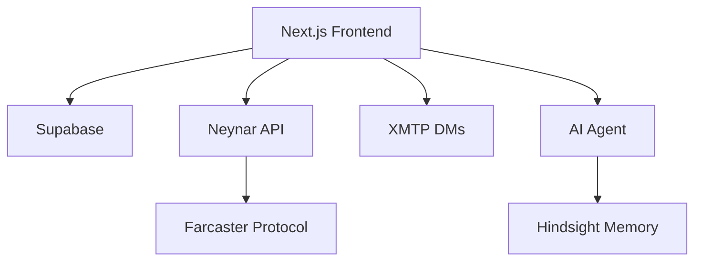

# 39 — GitHub Documentation, Presentation & Research Display

> **Status:** Research complete
> **Date:** March 2026
> **Goal:** Best practices for documenting, displaying, and showcasing ZAO OS and its 38 research docs on GitHub

---

## Priority Actions for ZAO OS

| # | Action | Impact | Effort |
|---|--------|--------|--------|
| 1 | **README overhaul** — hero banner, badges, GIF demo, quick start | Highest | Medium |
| 2 | **Research hub index** — `research/README.md` with categorized table | High | Small |
| 3 | **Social preview image** — 1280x640 branded image | High | Small |
| 4 | **GitHub Topics** — 10-15 tags for discoverability | High | Tiny |
| 5 | **Community files** — CONTRIBUTING.md, issue/PR templates | Medium | Small |
| 6 | **ADRs** — Document "why" behind key decisions | Medium | Medium |
| 7 | **CHANGELOG.md** — Keep a Changelog format | Medium | Small |
| 8 | **Build log** — `docs/build-log/` for build-in-public | Medium | Ongoing |
| 9 | **GitHub Releases** — Semantic versioning + auto notes | Medium | Small |
| 10 | **Docs site** — Fumadocs or Nextra (when ready) | Low (now) | Large |

---

## 1. README Best Practices

### Recommended Structure

1. **Badge row** — Build status, version, license, tech stack, community links
2. **Hero image** — 1280x640px branded banner (Figma/Canva)
3. **One-line description** — Plain language
4. **Quick nav links** — Docs, Demo, Report Bug, Request Feature
5. **Table of Contents** — Collapsible `<details>` tag
6. **Features** — 3-5 bullets with screenshot/GIF
7. **Built With** — Tech stack as shield badges
8. **Getting Started** — Copy-pasteable install commands
9. **Usage** — Code examples, screenshots
10. **Roadmap** — Checkbox task list
11. **Contributing** — Link to CONTRIBUTING.md
12. **License** — One line + link
13. **Community** — Farcaster, Discord links

### Badges (shields.io)

```markdown


```

Custom: `https://img.shields.io/badge/LABEL-MESSAGE-COLOR`

### Best READMEs to Study

| Project | Why It's Great |
|---------|---------------|
| **gofiber/fiber** | Clean branding, benchmarks, collapsible code |
| **othneildrew/Best-README-Template** | Gold-standard template |
| **refinedev/refine** | Multiple badges, demos, screenshots |
| **supabase** | Product screenshots, community stats |
| **shadcn/ui** | Usage examples, component previews |

---

## 2. Visual Documentation

### Screenshots

- **Format:** PNG for screenshots, SVG for diagrams/icons
- **Hosting:** Drag-drop into GitHub editor → uploads to `user-images.githubusercontent.com`
- **Sizing:** ``
- **Dark/light mode:** Use `<picture>` with `#gh-dark-mode-only` / `#gh-light-mode-only`

### Screen Recordings / GIFs

| Tool | Platform | Cost | Best For |
|------|----------|------|----------|
| **CleanShot X** | macOS | $29 | Best overall (record, annotate, cloud upload) |
| **Kap** | macOS | Free | Simple GIF/MP4 recording |
| **Gifox** | macOS | One-time | Quick GIF capture |
| **ScreenToGif** | Windows | Free | Record, trim, export |
| **OBS** | All | Free | Full video recording |

**GitHub GIF limit:** 10MB. Use 10 FPS, reduce color palette for smaller files.

**Video embeds:**
```markdown
[](https://youtube.com/watch?v=VIDEO_ID)
```

### Architecture Diagrams

**Mermaid (GitHub native — renders automatically):**
````markdown

````

**Other tools:**
- **Excalidraw** — hand-drawn aesthetic, export SVG/PNG
- **draw.io / diagrams.net** — professional diagrams, VS Code plugin
- **asciiflow.com** — ASCII art diagrams

---

## 3. Documentation Sites

### Best Options for Next.js Projects

| Framework | Built On | Best For | Next.js Fit |
|-----------|----------|----------|-------------|
| **Fumadocs** | Next.js | Embed docs in existing app (`/docs`) | Excellent (App Router native) |
| **Nextra 4.0** | Next.js | Separate docs subdomain | Excellent |
| **Docusaurus** | React | Large docs, versioning, i18n | Good (separate app) |
| **Astro Starlight** | Astro | Lightweight static docs | Good |
| **Mintlify** | SaaS | API-focused, automated | Moderate |

**Recommendation:** **Fumadocs** for embedding docs at `zaoos.com/docs` (same Next.js app) or **Nextra** for a separate docs site.

---

## 4. Research Hub Pattern

### `research/README.md` — The Index

Create a visually rich landing page for all 38 research docs:

```markdown
# ZAO OS Research Library

> 39 research documents covering every aspect of building
> a decentralized social media platform for music

## Infrastructure & Protocol

| # | Topic | Status | Date |
|---|-------|--------|------|
| 01 | [Farcaster Protocol](./01-farcaster-protocol/) | ✅ Complete | Mar 2026 |
| 02 | [Hub API](./02-farcaster-hub-api/) | ✅ Complete | Mar 2026 |
| ... | ... | ... | ... |

## Music & Curation

| # | Topic | Status | Date |
|---|-------|--------|------|
| 03 | [Music Integration](./03-music-integration/) | ✅ Complete | Mar 2026 |
| ... | ... | ... | ... |
```

### Linking Research to Implementation

- Each research doc: `Implementation: PR #42` or `Status: Implemented in v0.3.0`
- In code: `// See research/05-zao-identity for design rationale`
- ADRs bridge research → code decisions

### Living vs Snapshot Documents

- **Living** (actively updated): API docs, integration guides. Show "Last Updated" date.
- **Snapshot** (point-in-time): Ecosystem analysis, competitor research. Never modify — create new version.
- Mark each doc in its header: `> Type: Living Document` or `> Type: Snapshot (March 2026)`

---

## 5. GitHub Markdown Power Features

### Collapsible Sections

```html
<details>
<summary><strong>Click to expand: Full Architecture</strong></summary>

Full content here with markdown, code blocks, images.

</details>
```

### GitHub Alerts (Native)

```markdown
> [!NOTE]
> Informational highlight

> [!TIP]
> Helpful advice

> [!IMPORTANT]
> Key information

> [!WARNING]
> Potential issues

> [!CAUTION]
> Dangerous actions
```

Five types: NOTE (blue), TIP (green), IMPORTANT (purple), WARNING (yellow), CAUTION (red).

### HTML Tricks Allowed in GitHub

- `` — sized images
- `<picture>` — dark/light mode images
- `<details>` / `<summary>` — collapsible
- `<kbd>Ctrl</kbd>+<kbd>C</kbd>` — keyboard shortcuts
- `<div align="center">` — centered content
- `<sup>` / `<sub>` — superscript/subscript
- `<br>` — line breaks in table cells
- `<table>` — complex multi-column layouts

### Table Alignment

```markdown
| Left     | Center   | Right    |
|:---------|:--------:|---------:|
| aligned  | aligned  | aligned  |
```

---

## 6. Code Documentation

### ADRs (Architecture Decision Records)

Store in `docs/adr/`:
```
docs/adr/
  0001-use-neynar-for-farcaster-api.md
  0002-supabase-over-firebase.md
  0003-xmtp-for-encrypted-dms.md
  0004-elizaos-for-ai-agent.md
  0005-hindsight-over-pgvector.md
  template.md
```

**MADR format:**
- **Title:** Short name
- **Status:** Proposed / Accepted / Deprecated
- **Context:** What's the issue?
- **Decision:** What was decided and why?
- **Consequences:** Trade-offs?

### Community Files

| File | Purpose |
|------|---------|
| `CONTRIBUTING.md` | Setup, PR process, code style, commits |
| `CHANGELOG.md` | Keep a Changelog format (Added/Changed/Fixed) |
| `CODE_OF_CONDUCT.md` | Contributor Covenant |
| `SECURITY.md` | Vulnerability reporting |
| `.github/ISSUE_TEMPLATE/` | Bug report, feature request (YAML forms) |
| `.github/PULL_REQUEST_TEMPLATE.md` | PR checklist |

### Issue Templates (YAML)

```yaml
# .github/ISSUE_TEMPLATE/bug_report.yml
name: Bug Report
description: Report a bug in ZAO OS
labels: ["bug"]
body:
  - type: textarea
    attributes:
      label: What happened?
      description: Describe the bug
    validations:
      required: true
  - type: textarea
    attributes:
      label: Steps to reproduce
    validations:
      required: true
```

---

## 7. Build-in-Public

### Build Log Format

```
docs/build-log/
  2026-03-01-project-kickoff.md
  2026-03-05-auth-and-allowlist.md
  2026-03-10-farcaster-feed.md
```

Each entry: date, what was built, decisions, challenges, screenshots/GIFs.

### GitHub Releases

- Semantic versioning: `v0.1.0` (MVP), `v0.2.0` (DMs)
- Auto-generate notes from PR titles (`.github/release.yml`)
- Each release: version rationale, features, breaking changes

### CHANGELOG.md

```markdown
## [Unreleased]
### Added
- Music queue sidebar

## [0.2.0] - 2026-03-14
### Added
- XMTP encrypted DMs
- Notification system

### Fixed
- Reply button visibility on all messages
```

---

## 8. Project Showcase

### Social Preview Image

- **Dimensions:** 1280 x 640px
- **Format:** PNG/JPG under 1MB
- **Set:** Repository Settings > Social Preview > Edit
- **Generator:** [socialify.git.ci](https://socialify.git.ci) — creates from repo info in 3 clicks
- **Custom:** Figma frame with logo, project name, tagline, tech stack icons

### GitHub Topics (Add These)

```
farcaster, web3, music, nextjs, typescript, supabase,
decentralized, social, community, open-source, neynar,
xmtp, dao, music-nft, curation
```

### Pinned Repos Strategy (6 max)

1. **ZAOOS** — main app (the star)
2. **zao-agent** — AI agent (when built)
3. **zao-contracts** — smart contracts (future)
4. Future: ZID, Respect, Taste repos

### How Top Projects Do It

| Project | What to Borrow |
|---------|---------------|
| **Supabase** | Product screenshots, "built with" showcase, community stats |
| **Tailwind** | Minimal README → comprehensive docs site |
| **shadcn/ui** | Usage examples, component previews in docs |
| **Next.js** | Badge row, examples dir, GitHub Discussions |

---

## Sources

- [Best-README-Template](https://github.com/othneildrew/Best-README-Template)
- [awesome-readme](https://github.com/matiassingers/awesome-readme)
- [Shields.io](https://shields.io/)
- [Socialify](https://socialify.git.ci/)
- [GitHub Alerts](https://docs.github.com/en/get-started/writing-on-github/getting-started-with-writing-and-formatting-on-github/basic-writing-and-formatting-syntax#alerts)
- [Collapsible Sections](https://docs.github.com/en/get-started/writing-on-github/working-with-advanced-formatting/organizing-information-with-collapsed-sections)
- [Mermaid Diagrams on GitHub](https://docs.github.com/en/get-started/writing-on-github/working-with-advanced-formatting/creating-diagrams)
- [Fumadocs](https://www.fumadocs.dev/)
- [Nextra](https://nextra.site/)
- [ADR Examples](https://github.com/joelparkerhenderson/architecture-decision-record)
- [Keep a Changelog](https://keepachangelog.com/)
- [GitHub Issue Templates](https://docs.github.com/en/communities/using-templates-to-encourage-useful-issues-and-pull-requests)
- [Semantic Release](https://github.com/semantic-release/semantic-release)
