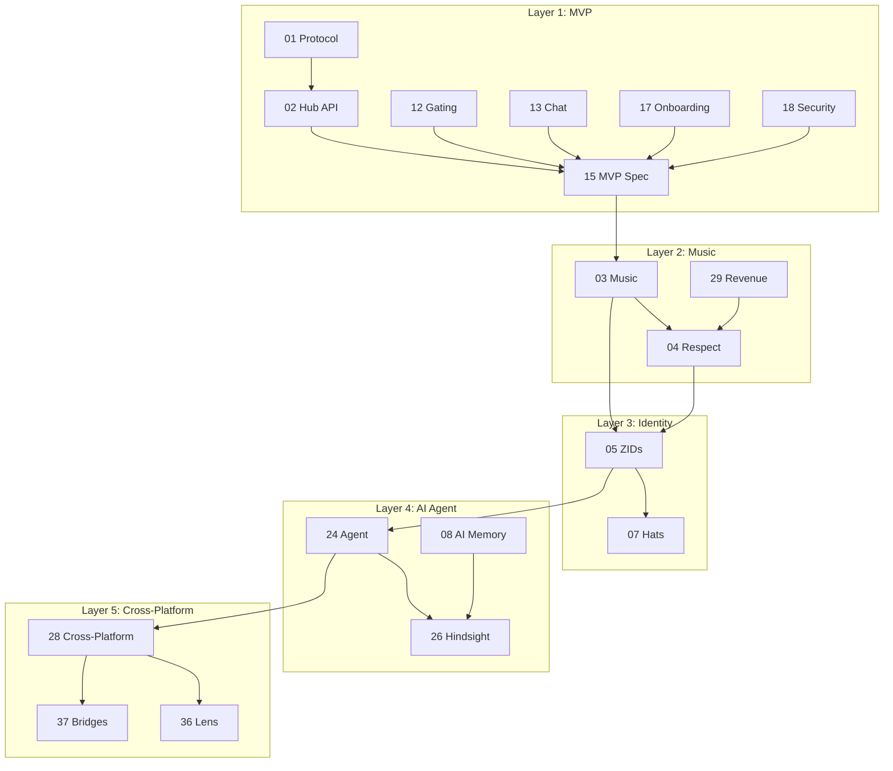

# ZAO OS Research Library

> **39 research documents** covering every aspect of building a decentralized social media platform for music — from protocol architecture to artist revenue models, AI agents to governance structures.

---

## Infrastructure & Protocol

| # | Topic | Status | Summary |
|---|-------|--------|---------|
| [01](./01-farcaster-protocol/) | Farcaster Protocol | ✅ Complete | On-chain identity (Optimism) + off-chain messaging (Snapchain 10K+ TPS) |
| [02](./02-farcaster-hub-api/) | Hub API & Neynar | ✅ Complete | REST + gRPC APIs, managed signers, Neynar as primary provider |
| [14](./14-project-structure/) | Project Structure | ✅ Complete | Single Next.js app, route groups, GitHub Projects kanban |
| [17](./17-neynar-onboarding/) | Neynar Onboarding | ✅ Complete | SIWF + managed signers + FID registration for new users |
| [18](./18-security-audit/) | Security Audit | ✅ Complete | Pre-build checklist: env, sessions, Zod, rate limits, CSRF |
| [33](./33-infrastructure-mobile-storage/) | Infrastructure & Mobile | ✅ Complete | Storage (R2/IPFS/Arweave), mobile (PWA→Capacitor), real-time, audio, privacy |

## Farcaster Ecosystem

| # | Topic | Status | Summary |
|---|-------|--------|---------|
| [19](./19-farcaster-ecosystem-landscape/) | Ecosystem Landscape | ✅ Complete | Open-source clients, frame frameworks, data providers |
| [21](./21-farcaster-deep-dive/) | Farcaster Deep Dive | ✅ Complete | Neynar acquisition, 40-60K DAU, developer-first pivot |
| [22](./22-farcaster-ecosystem-players/) | Ecosystem Players | ✅ Complete | Leaderboards, tokens (DEGEN/MOXIE/NOTES), mini apps, DAOs |
| [34](./34-farcaster-clients-notifications/) | Clients & Notifications | ✅ Complete | 18+ clients compared, 3-layer notification architecture |

## Community & Social

| # | Topic | Status | Summary |
|---|-------|--------|---------|
| [12](./12-gating/) | Gating Mechanisms | ✅ Complete | Allowlist → NFT → Hats → EAS progression |
| [13](./13-chat-messaging/) | Chat & Messaging | ✅ Complete | Farcaster channels (public) + XMTP (private encrypted) |
| [15](./15-mvp-spec/) | MVP Specification | ✅ Complete | Gated chat client, SIWF auth, allowlist, Discord-style UI |
| [16](./16-ui-reference/) | UI Reference | ✅ Complete | CG/Commonwealth patterns, navy+gold theme |
| [20](./20-followers-following-feed/) | Followers/Following | ✅ Complete | Sortable/filterable lists — unique differentiator |
| [32](./32-onboarding-growth-moderation/) | Onboarding & Growth | ✅ Complete | Privy embedded wallets, growth 40→1000, moderation, gamification |

## Music & Curation

| # | Topic | Status | Summary |
|---|-------|--------|---------|
| [03](./03-music-integration/) | Music Integration | ✅ Complete | Audius, Sound.xyz, Spotify APIs + unified Track schema |
| [04](./04-respect-tokens/) | Respect Tokens | ✅ Complete | Soulbound reputation: curation mining, tiers, 2% decay |
| [29](./29-artist-revenue-ip-rights/) | Artist Revenue & IP | ✅ Complete | Streaming economics, NFTs, 0xSplits, sync licensing, fan funding |
| [37](./37-bridges-competitors-monetization/) | Competitors & Monetization | ✅ Complete | Sound.xyz dead, Catalog dead, Coop Records model, Hypersub pricing |

## Identity & Roles

| # | Topic | Status | Summary |
|---|-------|--------|---------|
| [05](./05-zao-identity/) | ZAO Identity (ZIDs) | ✅ Complete | FID wrapper + music profile + Respect + roles |
| [06](./06-quilibrium/) | Quilibrium | ✅ Complete | Privacy-preserving storage, design-compatible but don't block |
| [07](./07-hats-protocol/) | Hats Protocol | ✅ Complete | On-chain role trees (curator/artist/mod) as ERC-1155 |
| [31](./31-governance-dao-tokenomics/) | Governance & Tokenomics | ✅ Complete | Wyoming DUNA, Safe multisig, ERC-1155, Coordinape, legal compliance |

## AI & Intelligence

| # | Topic | Status | Summary |
|---|-------|--------|---------|
| [08](./08-ai-memory/) | AI Memory | ✅ Complete | Implicit + explicit memory, pgvector, consolidation pipeline |
| [24](./24-zao-ai-agent/) | ZAO AI Agent | ✅ Complete | ElizaOS + Claude + Hindsight, 4-phase plan, separate repo |
| [26](./26-hindsight-agent-memory/) | Hindsight Memory | ✅ Complete | SOTA agent memory (91.4%), retain/recall/reflect, MCP support |

## Cross-Platform & Distribution

| # | Topic | Status | Summary |
|---|-------|--------|---------|
| [28](./28-cross-platform-publishing/) | Cross-Platform Publishing | ✅ Complete | 11 platforms mapped, fan-out architecture, Ayrshare shortcut |
| [36](./36-lens-protocol-deep-dive/) | Lens Protocol | ✅ Complete | V3 on Lens Chain, collect/monetize, no music apps = opportunity |

## APIs & Tools

| # | Topic | Status | Summary |
|---|-------|--------|---------|
| [09](./09-public-apis/) | Public APIs | ✅ Complete | Tier 1/2/3 API landscape for ZAO features |
| [25](./25-public-apis-index/) | Public APIs Index | ✅ Complete | 100+ APIs mapped by priority and phase |
| [23](./23-austin-griffith-eth-skills/) | Austin Griffith / ETH Skills | ✅ Complete | Scaffold-ETH 2, BuidlGuidl, ERC-8004, onchain credentials |
| [35](./35-notifications-complete-guide/) | Notifications Guide | ✅ Complete | Complete implementation guide: Mini App push + Supabase + polling |

## Reference & Meta

| # | Topic | Status | Summary |
|---|-------|--------|---------|
| [10](./10-hypersnap/) | Hypersnap | ⚠️ Incomplete | Needs manual review |
| [11](./11-reference-repos/) | Reference Repos | ✅ Complete | Sonata (MIT), Herocast (AGPL), Nook, Farcord |
| [27](./27-comprehensive-overview/) | Comprehensive Overview | ✅ Complete | Master index, gap analysis, vision map, research sprint plan |
| [30](./30-bettercallzaal-github/) | bettercallzaal GitHub | ✅ Complete | 65 repos mapped, 10 projects to integrate into ZAO OS |
| [38](./38-ai-code-audit-cleanup/) | AI Code Audit & Cleanup | ✅ Complete | Auditing AI code, cleanup agents, CI pipeline, TypeScript strict |
| [39](./39-github-documentation-presentation/) | GitHub Documentation | ✅ Complete | README best practices, visual docs, research display, showcase |

---

## How Research Connects to Implementation

---

## Research Stats

- **Total documents:** 39
- **Total research coverage:** ~250,000+ words
- **Topics covered:** Protocol, identity, music, AI agents, governance, revenue, cross-platform, mobile, storage, privacy, notifications, competitors, onboarding, moderation, code quality
- **Time span:** January - March 2026
- **Status:** 38/39 complete, 1 incomplete (Hypersnap)
