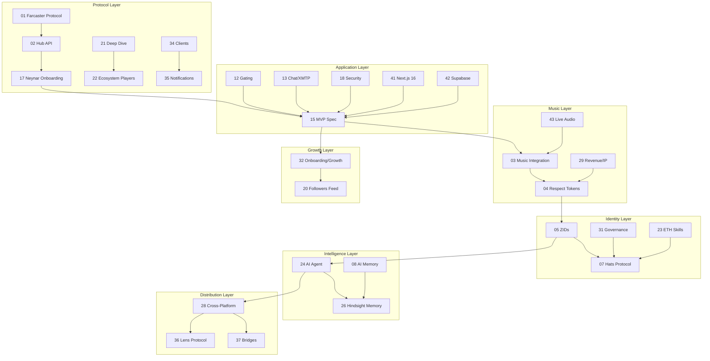

# ZAO OS Research Library

> **56 research documents** covering every aspect of building a decentralized social media platform for music — organized by topic for easy navigation.

---

## Farcaster Protocol & Ecosystem

Everything about the protocol ZAO OS is built on — how it works, who's building on it, and the tools available.

| # | Topic | Summary |
|---|-------|---------|
| [01](./01-farcaster-protocol/) | **Farcaster Protocol** | On-chain identity (Optimism) + off-chain messaging (Snapchain 10K+ TPS), storage units, FIDs, channels |
| [02](./02-farcaster-hub-api/) | **Hub API & Neynar** | REST + gRPC APIs, managed signers, Neynar as primary provider, SDK usage |
| [17](./17-neynar-onboarding/) | **Neynar Onboarding** | SIWF + managed signers + FID registration for wallet-only new users, EIP-712 |
| [19](./19-farcaster-ecosystem-landscape/) | **Ecosystem Landscape** | Open-source clients (Sonata, Herocast, Nook), frame frameworks, data providers |
| [21](./21-farcaster-deep-dive/) | **Farcaster Deep Dive (2026)** | Neynar acquisition, 40-60K DAU, Snapchain, developer-first pivot, what's coming next |
| [22](./22-farcaster-ecosystem-players/) | **Ecosystem Players & Leaderboards** | Top accounts, tokens (DEGEN/MOXIE/NOTES/CLANKER), mini apps, Purple DAO, analytics tools |
| [34](./34-farcaster-clients-notifications/) | **All Farcaster Clients Compared** | 18+ clients — pros/cons, features, notification systems, competitive positioning |
| [10](./10-hypersnap/) | **Hypersnap** | ⚠️ Incomplete — needs manual review |

---

## Music, Curation & Artist Revenue

The core of ZAO — how music works in the platform, how artists earn, and how curation creates value.

| # | Topic | Summary |
|---|-------|---------|
| [03](./03-music-integration/) | **Music Integration** | Audius, Sound.xyz, Spotify, SoundCloud, YouTube APIs + unified Track schema + audio player architecture |
| [04](./04-respect-tokens/) | **Respect Tokens** | Soulbound reputation: curation mining, tiers (newcomer→legend), 2% weekly decay, EAS attestation |
| [29](./29-artist-revenue-ip-rights/) | **Artist Revenue & IP Rights** | Streaming economics ($0.003/stream), music NFTs, 0xSplits, sync licensing ($650M market), fan funding, Hypersub |
| [37](./37-bridges-competitors-monetization/) | **Competitors & Monetization** | Sound.xyz dead, Catalog dead, Coop Records model, Hypersub pricing, revenue projections ($12K-$1.14M/yr) |
| [43](./43-webrtc-audio-rooms-streaming/) | **Live Audio Rooms & Streaming** | LiveKit (SFU), synchronized listening parties, Livepeer streaming, Huddle01 (web3-native), cost analysis |

---

## Community, Social & Growth

How ZAO gates access, manages members, grows from 40 to 1000+, and moderates content.

| # | Topic | Summary |
|---|-------|---------|
| [12](./12-gating/) | **Gating Mechanisms** | Allowlist (MVP) → NFT → Hats → EAS progression for access control |
| [13](./13-chat-messaging/) | **Chat & Messaging** | Farcaster channels (public) + XMTP (private encrypted DMs + groups) |
| [15](./15-mvp-spec/) | **MVP Specification** | Gated chat client scope, SIWF auth, allowlist, Discord-style UI, user flows |
| [20](./20-followers-following-feed/) | **Followers/Following Feed** | Sortable/filterable lists (no other Farcaster client has this), Neynar API patterns |
| [32](./32-onboarding-growth-moderation/) | **Onboarding, Growth & Moderation** | Privy embedded wallets, growth 40→1000 strategy, tiered moderation, gamification, analytics |
| [35](./35-notifications-complete-guide/) | **Notifications Complete Guide** | 3-layer hybrid: Mini App push + Supabase Realtime in-app + polling fallback, implementation details |

---

## Identity, Governance & Tokens

On-chain identity, community roles, DAO structure, token economics, and legal compliance.

| # | Topic | Summary |
|---|-------|---------|
| [05](./05-zao-identity/) | **ZAO Identity (ZIDs)** | FID wrapper + music profile + Respect score + community roles + linked wallets |
| [07](./07-hats-protocol/) | **Hats Protocol** | On-chain role trees (curator/artist/mod) as non-transferable ERC-1155, eligibility modules |
| [23](./23-austin-griffith-eth-skills/) | **Austin Griffith & ETH Skills** | Scaffold-ETH 2, BuidlGuidl model, SpeedRunEthereum, ERC-8004 trustless agents, onchain credentials |
| [31](./31-governance-dao-tokenomics/) | **Governance, DAO & Token Economics** | Wyoming DUNA ($300), Safe multisig, ERC-1155, Coordinape, Howey Test, legal compliance |
| [06](./06-quilibrium/) | **Quilibrium** | Privacy-preserving storage, Proof of Meaningful Work, design-compatible but don't block on it |
| [56](./56-ordao-respect-system/) | **ORDAO & Respect Game** | OREC consent-based governance, Fibonacci scoring (1-13), Respect1155 ERC-1155 tokens, fractal breakout rooms, parent/child token system |

---

## AI Agent & Intelligence

The ZAO AI agent — framework, memory system, and how it manages the community.

| # | Topic | Summary |
|---|-------|---------|
| [24](./24-zao-ai-agent/) | **ZAO AI Agent Plan** | ElizaOS + Claude + Hindsight, 4-phase plan (support → music discovery → moderation → autonomous) |
| [08](./08-ai-memory/) | **AI Memory Architecture** | Implicit + explicit memory patterns, pgvector, taste profiles, consolidation pipeline |
| [26](./26-hindsight-agent-memory/) | **Hindsight Memory System** | SOTA agent memory (91.4% LongMemEval), retain/recall/reflect, MCP support, per-user banks |

---

## Cross-Platform Publishing

How ZAO distributes content across every social platform from one compose bar.

| # | Topic | Summary |
|---|-------|---------|
| [28](./28-cross-platform-publishing/) | **Cross-Platform Publishing** | 11 platforms mapped (Lens, Bluesky, Nostr, X, Mastodon, Threads, Instagram, TikTok, YouTube), fan-out architecture |
| [36](./36-lens-protocol-deep-dive/) | **Lens Protocol Deep Dive** | V3 on Lens Chain (ZKSync), collect/monetize model, Bonsai token, no music apps = opportunity, ~1 week MVP |
| [37](./37-bridges-competitors-monetization/) | **Discord & Telegram Bridges** | discord.js v14 bridge architecture, Telegram Bot API, no production bridge exists yet = opportunity |

---

## Technical Infrastructure

The stack that runs ZAO OS — Next.js, Supabase, storage, mobile, real-time, and performance.

| # | Topic | Summary |
|---|-------|---------|
| [41](./41-nextjs16-react19-deep-dive/) | **Next.js 16 + React 19** | Turbopack, PPR, proxy.ts, React Compiler, useOptimistic, "use cache", streaming SSR, Tailwind v4 |
| [42](./42-supabase-advanced-patterns/) | **Supabase Advanced** | Schema design, RLS deep dive, Realtime (Broadcast > Postgres Changes), Edge Functions, pgvector, pg_cron, migrations |
| [33](./33-infrastructure-mobile-storage/) | **Storage, Mobile & Privacy** | R2/IPFS/Arweave costs, PWA→Capacitor→React Native, real-time infra, audio tech, Semaphore ZK proofs |
| [14](./14-project-structure/) | **Project Structure** | Single Next.js app decision, route groups, feature folders, GitHub Projects kanban |
| [16](./16-ui-reference/) | **UI Reference** | CG/Commonwealth patterns, Discord-style dark theme, navy #0a1628 + gold #f5a623 |

---

## APIs & External Services

Every API mapped, prioritized, and organized by ZAO OS feature.

| # | Topic | Summary |
|---|-------|---------|
| [09](./09-public-apis/) | **Public APIs Landscape** | Tier 1/2/3 APIs for music, web3, AI, media, social, notifications |
| [25](./25-public-apis-index/) | **Public APIs Index (100+)** | Full index from github.com/public-apis — mapped by ZAO feature and priority |

---

## Security, Auditing & Code Quality

How to keep the codebase secure, clean, and maintainable.

| # | Topic | Summary |
|---|-------|---------|
| [18](./18-security-audit/) | **Security Audit Checklist** | Pre-build security: env vars, sessions, Zod validation, rate limits, CSRF, CSP headers |
| [40](./40-codebase-audit-guide/) | **Codebase Audit Guide** | Step-by-step methodology + March 2026 audit results (1 critical, 2 high, 4 medium, 8 passing) |
| [38](./38-ai-code-audit-cleanup/) | **AI Code Audit & Cleanup** | AI code problems (1.75x more bugs), cleanup agents (Claude Code, Cursor), CI pipeline, TypeScript strict |

---

## Documentation & Presentation

How to document, display, and showcase the project on GitHub.

| # | Topic | Summary |
|---|-------|---------|
| [39](./39-github-documentation-presentation/) | **GitHub Documentation** | README best practices, screenshots, Mermaid diagrams, docs sites (Fumadocs/Nextra), ADRs, badges |

---

## Reference & Internal

Project references, existing code inventory, and strategic overviews.

| # | Topic | Summary |
|---|-------|---------|
| [11](./11-reference-repos/) | **Reference Repos** | Sonata (MIT), Herocast (AGPL), Nook (MIT), Opencast (MIT), Litecast (MIT) |
| [30](./30-bettercallzaal-github/) | **bettercallzaal GitHub Inventory** | 65 repos mapped — 10 directly integratable (fractalbot, zabalbot, zaomusicbot, ZAO-Leaderboard, ZOUNZ) |
| [27](./27-comprehensive-overview/) | **Comprehensive Overview** | Master index, gap analysis, vision map, flywheel, 9-layer roadmap, research sprint plan |
| [50](./50-wallet-connect/) | **Wallet Connect** | Wallet connection patterns |

---

## How Topics Connect

---

## Quick Reference by Role

### If you're building features:
Start with [41 Next.js 16](./41-nextjs16-react19-deep-dive/) + [42 Supabase](./42-supabase-advanced-patterns/) + [15 MVP Spec](./15-mvp-spec/)

### If you're adding music:
Start with [03 Music Integration](./03-music-integration/) + [43 Live Audio](./43-webrtc-audio-rooms-streaming/) + [29 Revenue](./29-artist-revenue-ip-rights/)

### If you're working on the AI agent:
Start with [24 Agent Plan](./24-zao-ai-agent/) + [26 Hindsight](./26-hindsight-agent-memory/) + [08 AI Memory](./08-ai-memory/)

### If you're designing governance:
Start with [31 Governance](./31-governance-dao-tokenomics/) + [04 Respect](./04-respect-tokens/) + [07 Hats](./07-hats-protocol/)

### If you're growing the community:
Start with [32 Onboarding/Growth](./32-onboarding-growth-moderation/) + [37 Competitors](./37-bridges-competitors-monetization/) + [35 Notifications](./35-notifications-complete-guide/)

### If you're auditing code:
Start with [40 Audit Guide](./40-codebase-audit-guide/) + [38 AI Code Audit](./38-ai-code-audit-cleanup/) + [18 Security](./18-security-audit/)

---

## Research Stats

- **Total documents:** 55
- **Total coverage:** ~300,000+ words
- **Topics:** Protocol, identity, music, AI agents, governance, revenue, cross-platform, mobile, storage, privacy, notifications, competitors, onboarding, moderation, code quality, infrastructure, live audio, documentation
- **Time span:** January — March 2026
- **Status:** 42/43 complete, 1 incomplete (Hypersnap)
