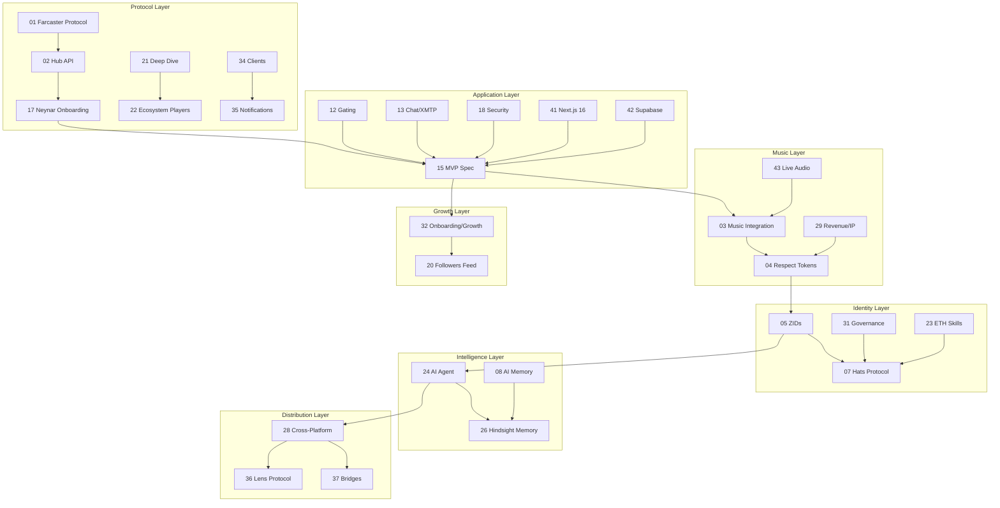

# ZAO OS Research Library

> **130+ research documents** covering every aspect of building a decentralized social media platform for music — organized by topic for easy navigation.

---

## Farcaster Protocol & Ecosystem

Everything about the protocol ZAO OS is built on — how it works, who's building on it, and the tools available.

| # | Topic | Summary |
|---|-------|---------|
| [01](./01-farcaster-protocol/) | **Farcaster Protocol** | On-chain identity (Optimism) + off-chain messaging (Snapchain 10K+ TPS), storage units, FIDs, channels |
| [02](./02-farcaster-hub-api/) | **Hub API & Neynar** | REST + gRPC APIs, managed signers, Neynar as primary provider, SDK usage |
| [17](./17-neynar-onboarding/) | **Neynar Onboarding** | SIWF + managed signers + FID registration for wallet-only new users, EIP-712 |
| [19](./19-farcaster-ecosystem-landscape/) | **Ecosystem Landscape** | Open-source clients (Sonata, Herocast, Nook), frame frameworks, data providers |
| [21](./21-farcaster-deep-dive/) | **Farcaster Deep Dive (2026)** | Neynar acquisition, 40-60K DAU, Snapchain, developer-first pivot, what's coming next |
| [22](./22-farcaster-ecosystem-players/) | **Ecosystem Players & Leaderboards** | Top accounts, tokens (DEGEN/MOXIE/NOTES/CLANKER), mini apps, Purple DAO, analytics tools |
| [34](./34-farcaster-clients-notifications/) | **All Farcaster Clients Compared** | 18+ clients — pros/cons, features, notification systems, competitive positioning |
| [73](./73-farcaster-ecosystem-2026-update/) | **Farcaster Ecosystem Update (Mar 2026)** | Neynar acquires Farcaster, Snapchain live, 40-60K DAU, Mini Apps, CLANKER, competitive landscape, ZAO implications |
| [86](./68-farcaster-miniapps-integration/) | **Farcaster Mini Apps Integration** | Mini Apps SDK, Quick Auth, notifications, cast composition — ZAO OS as a Mini App (folder named 68-) |
| [87](./81-farcaster-social-graph-sharing/) | **Farcaster Social Graph & Sharing** | Neynar user data APIs, social graph analysis, compose/share features for pre-generated member profiles (folder named 81-) |
| [10](./10-hypersnap/) | **Hypersnap** | ⚠️ Incomplete — needs manual review |

---

## Music, Curation & Artist Revenue

The core of ZAO — how music works in the platform, how artists earn, and how curation creates value.

| # | Topic | Summary |
|---|-------|---------|
| [03](./03-music-integration/) | **Music Integration** | Audius, Sound.xyz, Spotify, SoundCloud, YouTube APIs + unified Track schema + audio player architecture |
| [04](./04-respect-tokens/) | **Respect Tokens** | Soulbound reputation: curation mining, tiers (newcomer→legend), 2% weekly decay, EAS attestation |
| [29](./29-artist-revenue-ip-rights/) | **Artist Revenue & IP Rights** | Streaming economics ($0.003/stream), music NFTs, 0xSplits, sync licensing ($650M market), fan funding, Hypersub |
| [37](./37-bridges-competitors-monetization/) | **Competitors & Monetization** | Sound.xyz dead, Catalog dead, Coop Records model, Hypersub pricing, revenue projections ($12K-$1.14M/yr) |
| [43](./43-webrtc-audio-rooms-streaming/) | **Live Audio Rooms & Streaming** | LiveKit (SFU), synchronized listening parties, Livepeer streaming, Huddle01 (web3-native), cost analysis |
| [80](./80-jitsi-meet-live-rooms/) | **Jitsi Meet Live Rooms** | Embeddable Jitsi rooms for fractal calls + community meetings, zero-install, self-hostable |
| [88](./82-music-social-platform-redesign/) | **Music-First Social Platform Redesign** | Redesign ZAO OS from "chat client with music" into THE social platform for music communities (folder named 82-) |
| [100](./100-synchronized-listening-rooms/) | **Synchronized Listening Rooms** | Listening parties via Supabase Broadcast + Presence, DJ mode, chat overlay, Jitsi voice integration, $0 infra |

---

## Community, Social & Growth

How ZAO gates access, manages members, grows from 40 to 1000+, and moderates content.

| # | Topic | Summary |
|---|-------|---------|
| [12](./12-gating/) | **Gating Mechanisms** | Allowlist (MVP) → NFT → Hats → EAS progression for access control |
| [13](./13-chat-messaging/) | **Chat & Messaging** | Farcaster channels (public) + XMTP (private encrypted DMs + groups) |
| [74](./74-xmtp-v4-mls-encryption/) | **XMTP V3 Browser SDK & MLS** | V3 unified SDK, MLS encryption, mainnet fees (~$0.001/msg), history sync gap, payer wallet required |
| [15](./15-mvp-spec/) | **MVP Specification** | Gated chat client scope, SIWF auth, allowlist, Discord-style UI, user flows |
| [20](./20-followers-following-feed/) | **Followers/Following Feed** | Sortable/filterable lists (no other Farcaster client has this), Neynar API patterns |
| [32](./32-onboarding-growth-moderation/) | **Onboarding, Growth & Moderation** | Privy embedded wallets, growth 40→1000 strategy, tiered moderation, gamification, analytics |
| [35](./35-notifications-complete-guide/) | **Notifications Complete Guide** | 3-layer hybrid: Mini App push + Supabase Realtime in-app + polling fallback, implementation details |
| [47](./47-zao-community-ecosystem/) | **ZAO Community Ecosystem** | ZAO community ecosystem mapping |
| [48](./48-zao-ecosystem-deep-dive/) | **ZAO Ecosystem Deep Dive** | Deep dive into ecosystem components |

---

## Identity, Governance & Tokens

On-chain identity, community roles, DAO structure, token economics, and legal compliance.

| # | Topic | Summary |
|---|-------|---------|
| [05](./05-zao-identity/) | **ZAO Identity (ZIDs)** | FID wrapper + music profile + Respect score + community roles + linked wallets |
| [07](./07-hats-protocol/) | **Hats Protocol** | On-chain role trees (curator/artist/mod) as non-transferable ERC-1155, eligibility modules |
| [23](./23-austin-griffith-eth-skills/) | **Austin Griffith & ETH Skills** | Scaffold-ETH 2, BuidlGuidl model, SpeedRunEthereum, ERC-8004 trustless agents, onchain credentials |
| [31](./31-governance-dao-tokenomics/) | **Governance, DAO & Token Economics** | Wyoming DUNA ($300), Safe multisig, ERC-1155, Coordinape, Howey Test, legal compliance |
| [06](./06-quilibrium/) | **Quilibrium** | Privacy-preserving storage, Proof of Meaningful Work, design-compatible but don't block on it |
| [55](./55-hats-anchor-app-and-tooling/) | **Hats Anchor App & Tooling** | DAO tooling landscape, Hats Anchor App, OpenFang update |
| [56](./56-ordao-respect-system/) | **ORDAO & Respect Game** | OREC consent-based governance, Fibonacci scoring (1-13), Respect1155 ERC-1155 tokens, fractal breakout rooms, parent/child token system |
| [58](./58-respect-deep-dive/) | **Respect Deep Dive** | On-chain token data, scoring math, orclient SDK integration |
| [102](./102-fractals-frapps-ordao-page/) | **Fractals Page + frapps + ORDAO** | frapps.xyz tech stack, ORDAO orclient SDK, Fibonacci scoring, /fractals page design, what's built vs missing |
| [103](./103-fractal-governance-ecosystem/) | **Fractal Governance Ecosystem** | Eden Fractal (Base, active), Optimism Fractal (paused), Fractally (dormant), music fractal opportunity, Optimystics roadmap, Competition App |
| [104](./104-fractal-communities-directory/) | **Fractal Communities Directory** | 25+ communities mapped: active/paused/dormant, chain distribution, ZAO as only music fractal, collaboration opportunities |
| [105](./105-fractal-key-people/) | **Fractal Key People** | Dan SingJoy (musician/founder/host), Tadas Vaitiekunas (ORDAO/OREC creator), outreach strategy for ZAO |
| [106](./106-dan-singjoy-eden-fractal-deep-dive/) | **Dan SingJoy + Eden Fractal Deep Dive** | Epoch 2 on Base, Season 12, bi-weekly Thu 17:00 UTC, Cignals competition app, Fractal DJ game, tripartite governance |
| [108](./108-superchain-ordao-crosschain-fractal/) | **Superchain ORDAO + Cross-Chain** | Hub-and-spoke architecture, ZAO-Eden cross-chain Respect, Hats+Respect auto-gating, Optimism grants opportunities |
| [109](./109-optimystics-tooling-ecosystem/) | **Optimystics Tooling Ecosystem** | orclient SDK (npm), ornode API (12 endpoints), OREC contract ABI, Cignals alpha, Fractalgram fork analysis, FRAPPS deployment |
| [113](./113-zao-fractal-bot-process/) | **ZAO Fractal Bot + Process** | Discord bot (Python, 52 commands), step-by-step fractal flow, 2x Fibonacci scoring, frapps submission, OG vs ZOR Respect, 90 weeks of sessions, integration plan |
| [114](./114-zao-fractal-live-infrastructure/) | **ZAO Fractal Live Infrastructure** | What's deployed now, OREC 175 txns, webhook data flow, bot history format, frapps URL format, ZAO OS integration architecture |
| [115](./115-zao-data-reconciliation/) | **ZAO Respect Data Reconciliation** | Complete data map: OG era (1-73.2) + ORDAO era (74-90+), 6 Airtable CSVs + 3 awards CSVs, 173 members + 42 on-chain, import plan |
| [116](./116-discord-integration-research/) | **Discord API Integration** | @discordjs/rest for server-side reads, OAuth2 account linking, webhook from bot, supabase-py for bot sync, rate limits |
| [59](./59-hats-tree-integration/) | **Hats Tree Integration** | Hats Protocol tree structure for ZAO roles |
| [75](./75-hats-protocol-v2-updates/) | **Hats Protocol V2 Updates** | New eligibility modules, HSG v2, subgraph SDK v1.0.0, MCP server for AI, ERC-6551 accounts |
| [78](./78-nouns-builder-integration/) | **Nouns Builder Integration** | Daily NFT auctions, 5-contract DAO suite, builder-template-app (MIT/Next.js), builder-farcaster, iframe/embed options for ZABAL DAO |
| [79](./79-songjam-music-player-research/) | **SongJam Music Player Research** | 2026-music-player is Electron torrent streamer (not useful). ZAO OS player already better. Borrow: 100ms live audio, leaderboard treemap |
| [126](./126-music-player-gap-analysis/) | **Music Player Gap Analysis** | ZAO vs Spotify/Audius/SoundCloud/Sonata: 12 missing features (favorites, history, queue, presence, reactions), prioritized build order, competitive matrix |
| [127](./127-mobile-player-optimization/) | **Mobile Player Optimization** | MediaSession completion, swipe gestures, expanded full-screen player, crossfade/@regosen/gapless-5, Wake Lock, iOS PWA audio workarounds, haptics |
| [128](./128-music-player-complete-audit/) | **Music Player Complete Audit** | **CANONICAL** — 23 components, 23 API endpoints, 9 platforms, every feature cataloged + verified in code, 17 future features prioritized in 4 tiers |
| [130](./130-next-music-integrations/) | **Next Music Integrations (Tier 4)** | Spotify Web API (audio features, recs), Audius SDK deep, Farcaster music embeds, AI recs (pgvector + collaborative filtering), Zora music NFTs on Base, Last.fm scrobbling |
| [131](./131-onchain-proposals-governance/) | **On-Chain Governance** | ZOUNZ Nouns Builder Governor (already deployed on Base), Snapshot gasless voting, OZ Governor + Respect, hybrid 3-tab architecture, builder-utils SDK, implementation sprints |
| [132](./132-snapshot-weekly-polls/) | **Snapshot Weekly Polls** | One-click weekly priority polls via snapshot.js SDK, approval voting, GraphQL display, multi-project templates (ZAO, B&Z, etc.) |
| [133](./133-governance-system-audit/) | **Governance System Complete Audit** | **CANONICAL** -- 3-tier governance (ZOUNZ on-chain, Snapshot polls, Community proposals), 5 API routes, 6 components, Respect-weighted voting, auto-publish to Farcaster/Bluesky/X, all features cataloged + verified in code |
| [119](./119-songjam-audio-spaces-embed/) | **SongJam Audio Spaces Embed** | Embed songjam.space/zabal iframe for live audio rooms. Fix iframe permissions (microphone/camera). 100ms SDK architecture, LiveAudioRoom component, /zabal page structure |
| [122](./122-songjam-screen-share-pr/) | **SongJam Screen Share PR** | Add screen sharing to SongJam /spaces via Stream Video SDK. PR plan: MyScreenShareButton + ScreenShareView components. No Daily.co needed — Stream has built-in support |

---

## AI Agent & Intelligence

The ZAO AI agent — framework, memory system, and how it manages the community.

| # | Topic | Summary |
|---|-------|---------|
| [24](./24-zao-ai-agent/) | **ZAO AI Agent Plan** | ElizaOS + Claude + Hindsight, 4-phase plan (support → music discovery → moderation → autonomous) |
| [08](./08-ai-memory/) | **AI Memory Architecture** | Implicit + explicit memory patterns, pgvector, taste profiles, consolidation pipeline |
| [26](./26-hindsight-agent-memory/) | **Hindsight Memory System** | SOTA agent memory (91.4% LongMemEval), retain/recall/reflect, MCP support, per-user banks |

---

## Cross-Platform Publishing

How ZAO distributes content across every social platform from one compose bar.

| # | Topic | Summary |
|---|-------|---------|
| [28](./28-cross-platform-publishing/) | **Cross-Platform Publishing** | 11 platforms mapped (Lens, Bluesky, Nostr, X, Mastodon, Threads, Instagram, TikTok, YouTube), fan-out architecture |
| [36](./36-lens-protocol-deep-dive/) | **Lens Protocol Deep Dive** | V3 on Lens Chain (ZKSync), collect/monetize model, Bonsai token, no music apps = opportunity, ~1 week MVP |
| [37](./37-bridges-competitors-monetization/) | **Discord & Telegram Bridges** | discord.js v14 bridge architecture, Telegram Bot API, no production bridge exists yet = opportunity |
| [77](./77-bluesky-cross-posting-integration/) | **Bluesky Cross-Posting Integration** | @atproto/api SDK, App Password + OAuth flows, 300-char posts, custom feeds, ZAO labeler, 3-phase plan |
| [96](./96-mastodon-threads-cross-posting/) | **Mastodon + Threads Cross-Posting** | Mastodon REST API + masto.js SDK, multi-instance OAuth, music instances (sonomu.club); Threads 2-step publish, Meta OAuth, 250 posts/24hr, no official SDK |
| [123](./123-dfos-dark-forest-protocol/) | **DFOS (Dark Forest OS)** | Private-first creative group infrastructure by Metalabel (Kickstarter co-founder). No blockchain, Ed25519 chains, `did:dfos`, ~2K alpha users. Philosophy-aligned with ZAO but different stack. |

---

## Technical Infrastructure

The stack that runs ZAO OS — Next.js, Supabase, storage, mobile, real-time, and performance.

| # | Topic | Summary |
|---|-------|---------|
| [41](./41-nextjs16-react19-deep-dive/) | **Next.js 16 + React 19** | Turbopack, PPR, proxy.ts, React Compiler, useOptimistic, "use cache", streaming SSR, Tailwind v4 |
| [42](./42-supabase-advanced-patterns/) | **Supabase Advanced** | Schema design, RLS deep dive, Realtime (Broadcast > Postgres Changes), Edge Functions, pgvector, pg_cron, migrations |
| [93](./93-supabase-scaling-optimization/) | **Supabase Scaling & Optimization** | Realtime primitives mapped to features, pg_cron jobs (7 scheduled), pgvector for music taste/semantic search, Edge Functions vs API routes, Storage optimization, indexing audit, branching, cost projections 100-1,000 members |
| [33](./33-infrastructure-mobile-storage/) | **Storage, Mobile & Privacy** | R2/IPFS/Arweave costs, PWA→Capacitor→React Native, real-time infra, audio tech, Semaphore ZK proofs |
| [14](./14-project-structure/) | **Project Structure** | Single Next.js app decision, route groups, feature folders, GitHub Projects kanban |
| [16](./16-ui-reference/) | **UI Reference** | CG/Commonwealth patterns, Discord-style dark theme, navy #0a1628 + gold #f5a623 |

---

## WaveWarZ Integration

Solana prediction market for music battles — artist discovery pipeline, profile enrichment, and governance synergy.

| # | Topic | Summary |
|---|-------|---------|
| [95](./95-solana-wavewarz-multi-wallet-settings/) | **Solana + WaveWarZ Initial Research** | Solana wallet adapter setup, WaveWarZ partnership overview, multi-wallet settings redesign |
| [96](./96-wavewarz-deep-dive-integration/) | **WaveWarZ Deep Dive** | Battle mechanics (parimutuel pools), economics (98.5% in ecosystem), 3-tool ecosystem, platform stats |
| [97](./97-wavewarz-integration-blueprints/) | **Artist Discovery Pipeline** | Artist Discovery Pipeline: sync 43 WaveWarZ artists into Supabase, spotlight auto-casts, profile enrichment, recruitment |
| [99](./99-prediction-market-music-battles/) | **Prediction Market Schema** | Parimutuel pool mechanics, Supabase schema for ZAO-hosted battles, settlement math, UI wireframes |
| [100](./100-solana-pda-reading-nextjs/) | **Solana PDA Reading in Next.js** | Battle Vault PDA reads via web3.js, buffer-layout deserialization, Helius RPC setup, WaveWarZ vault patterns |
| [101](./101-wavewarz-zao-whitepaper/) | **WaveWarZ × ZAO OS Whitepaper** | **CANONICAL** — Full integration strategy: platform deep-dive, artist data (43 wallets, 647 battles, $38K volume), Artist Discovery Pipeline architecture, governance synergy, 10-day roadmap |

---

## APIs & External Services

Every API mapped, prioritized, and organized by ZAO OS feature.

| # | Topic | Summary |
|---|-------|---------|
| [09](./09-public-apis/) | **Public APIs Landscape** | Tier 1/2/3 APIs for music, web3, AI, media, social, notifications |
| [25](./25-public-apis-index/) | **Public APIs Index (100+)** | Full index from github.com/public-apis — mapped by ZAO feature and priority |
| [125](./125-coinflow-fiat-checkout/) | **Coinflow Fiat Checkout** | Fiat-to-crypto checkout (cards, ACH, Apple Pay) → USDC on Base. EVM contract settlement, React SDK, 24+ webhook events, Credits system. For memberships, WaveWarZ entries, tips. |

---

## Security, Auditing & Code Quality

How to keep the codebase secure, clean, and maintainable.

| # | Topic | Summary |
|---|-------|---------|
| [18](./18-security-audit/) | **Security Audit Checklist** | Pre-build security: env vars, sessions, Zod validation, rate limits, CSRF, CSP headers |
| [40](./40-codebase-audit-guide/) | **Codebase Audit Guide** | Step-by-step methodology + March 2026 audit results (1 critical, 2 high, 4 medium, 8 passing) |
| [38](./38-ai-code-audit-cleanup/) | **AI Code Audit & Cleanup** | AI code problems (1.75x more bugs), cleanup agents (Claude Code, Cursor), CI pipeline, TypeScript strict |
| [57](./57-codebase-security-audit-march-2026/) | **Security Audit (March 2026)** | Full codebase security audit results and fixes |
| [66](./66-backend-testing-strategy/) | **Backend Testing Strategy** | Vitest + NTARH + MSW stack, 47-route audit, backend testbench checklist, AI-code testing patterns |

---

## Development Workflows & Agent Tooling

How to use AI agents, skills, and autonomous loops to build and maintain ZAO OS.

| # | Topic | Summary |
|---|-------|---------|
| [44](./44-agentic-development-workflows/) | **Agentic Development Workflows** | Claude Code as persistent dev partner, hooks, GitHub Actions agents, CI pipeline, PR-based agent workflow |
| [45](./45-research-organization-patterns/) | **Research Organization Patterns** | Research library organization and maintenance |
| [46](./46-openfang-agent-os/) | **OpenFang Agent OS** | Rust-based agent OS — reference architecture (not a fit for ZAO) |
| [54](./54-superpowers-agentic-skills/) | **Superpowers Agentic Skills** | Skill system for Claude Code — brainstorming, TDD, debugging, planning, parallel agents, code review |
| [62](./62-autoresearch-skill-improvement/) | **Autoresearch: Skill Improvement** | Karpathy's autoresearch loop adapted for Claude Code skills — binary checklist scoring, atomic changes, auto-revert |
| [63](./63-autoresearch-deep-dive-zao-applications/) | **Autoresearch Deep Dive** | Implementation comparison (3 repos), eval loop mechanics, 7 ZAO OS use cases (skills, lint, security, governance, API routes) |
| [64](./64-incented-zabal-campaigns/) | **Incented + ZABAL Campaigns** | Incented coordination protocol (4-stage staking), ZABAL org campaigns, ZAO OS integration roadmap |
| [65](./65-zabal-partner-ecosystem/) | **ZABAL Partner Ecosystem** | MAGNETIQ (Proof of Meet), SongJam (leaderboard), Empire Builder (token rewards), Clanker (token launcher) — integration plans |
| [67](./67-paperclip-ai-agent-company/) | **Paperclip AI: ZAO Agent Company** | Open-source agent orchestrator — org chart, budgets, heartbeats. 5 ZAO agents defined, full startup guide. |
| [68](./68-alibaba-page-agent/) | **Alibaba Page Agent** | In-page AI copilot via DOM dehydration. Admin copilot potential for ZAO OS. Not yet — Phase 3. |
| [69](./69-claude-code-tips-best-practices/) | **Claude Code Tips & Best Practices** | 45 tips audited against ZAO OS setup. Gaps: no tests, no HANDOFF.md, no cc-safe. ZAO leads on research/skills. |
| [70](./70-subagents-vs-agent-teams/) | **Sub-agents vs Agent Teams** | Two multi-agent paradigms + Claude Architect patterns + Cowork starter pack. Maps to Paperclip + Claude Code. |
| [71](./71-paperclip-rate-limits-multi-agent/) | **Paperclip Rate Limits** | Multi-agent API key management, Anthropic tier limits, thundering herd fix, staggering strategies |
| [72](./72-paperclip-functionality-deep-dive/) | **Paperclip Functionality Deep Dive** | Full agent lifecycle, 9-step heartbeat, adapter config, "Standing By" root cause + fix, CLI reference |
| [76](./76-git-branching-ai-agents/) | **Git Branching for AI Agents** | Trunk-based dev with Paperclip agents, short-lived branches, merge strategy for solo founder + AI |
| [81](./81-paperclip-multi-company-agents/) | **Paperclip Multi-Company + Advanced Patterns** | Multi-company isolation, 5-level task hierarchy, agent delegation chains, approval workflows |
| [82](./82-paperclip-clipmart-plugins/) | **Paperclip ClipMart + Plugin System** | Template marketplace, export/import, plugin architecture, building ZAO-specific plugins |
| [83](./83-elizaos-2026-update/) | **ElizaOS March 2026 Update** | v1.7.2 stable, v2 alpha, Farcaster/XMTP plugins, Supabase adapter, character files, deployment, cost |
| [85](./85-farcaster-agent-technical-setup/) | **Farcaster AI Agent Technical Setup** | Step-by-step Neynar agent setup, FID registration, managed signers, deployment guide |
| [84](./84-farcaster-ai-agents-landscape/) | **Farcaster AI Agents Landscape** | Full landscape of AI agents/bots on Farcaster as of March 2026, for building ZAO community bot |

---

## Ethereum & Alignment

Ethereum philosophy, EF alignment, and opportunities for ZAO.

| # | Topic | Summary |
|---|-------|---------|
| [60](./60-vitalik-ethereum-philosophy/) | **Vitalik & Ethereum Philosophy** | Vitalik philosophy + EF mandate alignment analysis |
| [61](./61-ethereum-alignment-opportunities/) | **Ethereum Alignment Opportunities** | Ethereum alignment opportunities for ZAO |

---

## Documentation & Presentation

How to document, display, and showcase the project on GitHub.

| # | Topic | Summary |
|---|-------|---------|
| [39](./39-github-documentation-presentation/) | **GitHub Documentation** | README best practices, screenshots, Mermaid diagrams, docs sites (Fumadocs/Nextra), ADRs, badges |
| [51](./51-zao-whitepaper-2026/) | **ZAO Whitepaper 2026** | Whitepaper Draft 4.5 — vision, tokenomics, governance |
| [52](./52-whitepaper-presentation-critique/) | **Whitepaper Presentation Critique** | Whitepaper critique and feedback |
| [53](./53-whitepaper-user-testing/) | **Whitepaper User Testing** | User testing results for the whitepaper |

---

## Reference & Internal

Project references, existing code inventory, and strategic overviews.

| # | Topic | Summary |
|---|-------|---------|
| [11](./11-reference-repos/) | **Reference Repos** | Sonata (MIT), Herocast (AGPL), Nook (MIT), Opencast (MIT), Litecast (MIT) |
| [50](./50-the-zao-complete-guide/) | **The ZAO Complete Guide** | Canonical project reference — the definitive ZAO ecosystem guide |
| [30](./30-bettercallzaal-github/) | **bettercallzaal GitHub Inventory** | 65 repos mapped — 10 directly integratable (fractalbot, zabalbot, zaomusicbot, ZAO-Leaderboard, ZOUNZ) |
| [27](./27-comprehensive-overview/) | **Comprehensive Overview** | Master index, gap analysis, vision map, flywheel, 9-layer roadmap, research sprint plan |
| [49](./49-wallet-connect/) | **Wallet Connect** | Wallet connection patterns |

---

## How Topics Connect

---

## Quick Reference by Role

### If you're building features:
Start with [41 Next.js 16](./41-nextjs16-react19-deep-dive/) + [42 Supabase](./42-supabase-advanced-patterns/) + [15 MVP Spec](./15-mvp-spec/)

### If you're adding music:
Start with [03 Music Integration](./03-music-integration/) + [43 Live Audio](./43-webrtc-audio-rooms-streaming/) + [29 Revenue](./29-artist-revenue-ip-rights/)

### If you're working on the AI agent:
Start with [24 Agent Plan](./24-zao-ai-agent/) + [26 Hindsight](./26-hindsight-agent-memory/) + [08 AI Memory](./08-ai-memory/)

### If you're designing governance:
Start with [31 Governance](./31-governance-dao-tokenomics/) + [04 Respect](./04-respect-tokens/) + [07 Hats](./07-hats-protocol/)

### If you're growing the community:
Start with [32 Onboarding/Growth](./32-onboarding-growth-moderation/) + [37 Competitors](./37-bridges-competitors-monetization/) + [35 Notifications](./35-notifications-complete-guide/)

### If you're auditing code:
Start with [40 Audit Guide](./40-codebase-audit-guide/) + [38 AI Code Audit](./38-ai-code-audit-cleanup/) + [18 Security](./18-security-audit/)

---

## Research Stats

- **Total documents:** 130+
- **Total coverage:** ~400,000+ words
- **Topics:** Protocol, identity, music, AI agents, governance, revenue, cross-platform, mobile, storage, privacy, notifications, competitors, onboarding, moderation, code quality, infrastructure, live audio, documentation, fractals, WaveWarZ, music player
- **Time span:** January — March 2026
- **Status:** 129/130+ complete, 1 incomplete (Hypersnap)
